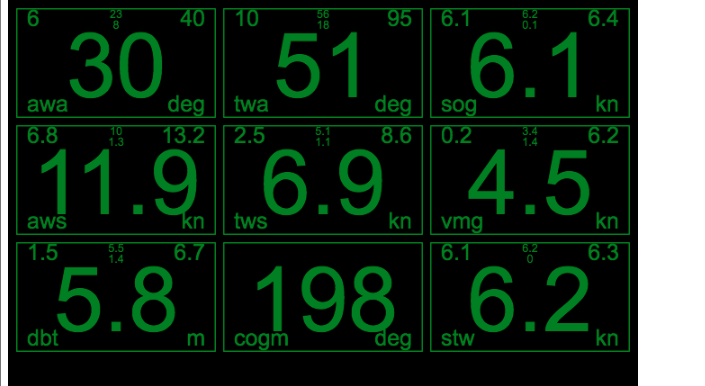

# eink UI for SignalK data

Ever tried to read the screen of a phone, ipad or tablet at sea in intense direct sunlight ? Even those designed of outdoor use (toughbooks) are hard to read.

Low energy consumption displays for intense direct sunlight are hard to source. High energy displays with > 1500 nit  do exist, but typucally require > 1A @ 12v for a 7.8 inch display. Standard monitors and tablets are typically 350 nit.
Transreflective displays (150ma for a 7.8 inch dispay) are generally not available since mainstream usage is moving towards high energy. There are some transreflective displays on Alibaba, and many instrument manufacturers (eg NKE) buy in 1000s.

eInk is an alternative. Power consumption is minimal. Waveshark produces some units with quite low update rates (5s full screen refresh), and users report problems with the eink gosting or becomming damaged after many updates.

To use a custom display pannel to build a waterproof display and then to interface it with a SignalK server could be done, however there is probably an easier way.

An alternative is to use the experimental or beta browsers  in e readers such as Kindle Paperwhite or Kobo Libra H2O, both of which are IP8x waterproof, have battery lives into days, and are fully readable in intense direct sunlight. 

The browsers are mostly webkit based, although the version tends to be 4-6 years old. The nature of the Kindle version is unknown. The Kobo Beta Browser is believed to be a WebKit version from 2013. The have limited css support, minimal HTML5, Javascript is pre ES5 with no websocket support and nothing as sophisticated as JSON.parse. They do however have Canvas and AJAX.

This project contains a UI that polls a NMEA endpoint for a NMEA sentence updates since the last poll. The UI uses Canvas and targets the limit capabilities of the a Kindle experimental browser. Currently being developed on a very old Kindle version 3.

# Current state

* Multiple pages
* Landscape and Portrate
* min, max, mean, standard deviation
* linear and circular stats
* Themes, night, day, red, green
* Calculates missing sensors where possible.
* Caclulates full set of performance data from a Polar, currently set to Pogo1250 polar.

# Photos and screenshots

The kindle photos show some of the problems with eink, where there are traces of previous numbers showing. The phone camera is good a picking up what the naked eye cant see. These tend to dissapear on full screen refresh. The number here update once every 2s.

